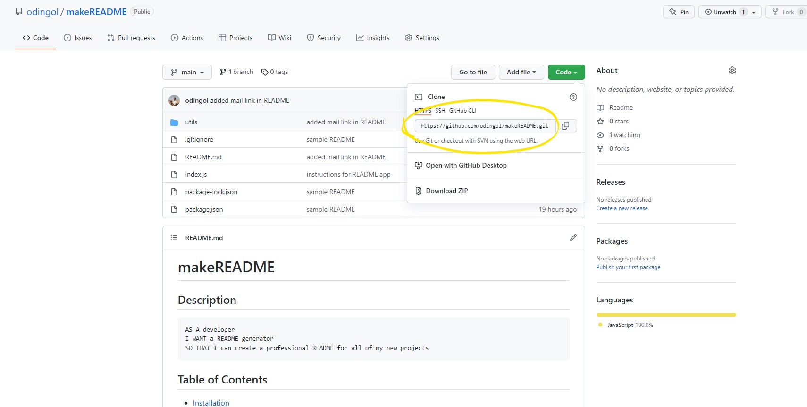

# makeREADME
## Description

```md
AS A developer 
I WANT a README generator 
SO THAT I can create a professional README for all of my new projects
```
    
## Table of Contents
    
- [Installation](#installation)
- [Usage](#usage)
- [License](#license)
- [Contribute](#contribute)
- [Tests](#tests)
- [Questions](#questions)
    
## Installation
    
1) Go to my Github and clone this repo



<br>

2) Once downloaded, copy the code "npm install" and paste inside the terminal of your code editor

```bash
npm install
```

3) Once step 2 is completed, copy the code "node index.js" and paste inside the terminal to begin answering the prompt questions for the README set up

```bash
node index.js
```

4) After all questions are completed, the README.md file is instantly created in the same folder.
    
 ## Usage
<br>
This makeREADME app is designed to create a professional README file from the user's input. A README file is created only when the user finishes answering all of the prompt questions. The user is also given the freedom to style their README in whatever format they wish. 


<br>Here is an example of the use of the application:

<br>


<br><br>
    
## License 
[](https://opensource.org/licenses/ISC)
    
    
The license included for this project is under ISC
    
    
## Contribute 
[](https://github.com/odingol/makeREADME/issues)
    
Please click on the badge to report any issues if they exist
    
    
## Tests
    
There are no tests included for this application
    

## Questions
    
Contact me: 

- [Github Profile](https://github.com/odingol) 
- [E-mail](mailto:lodingo@yahoo.com)